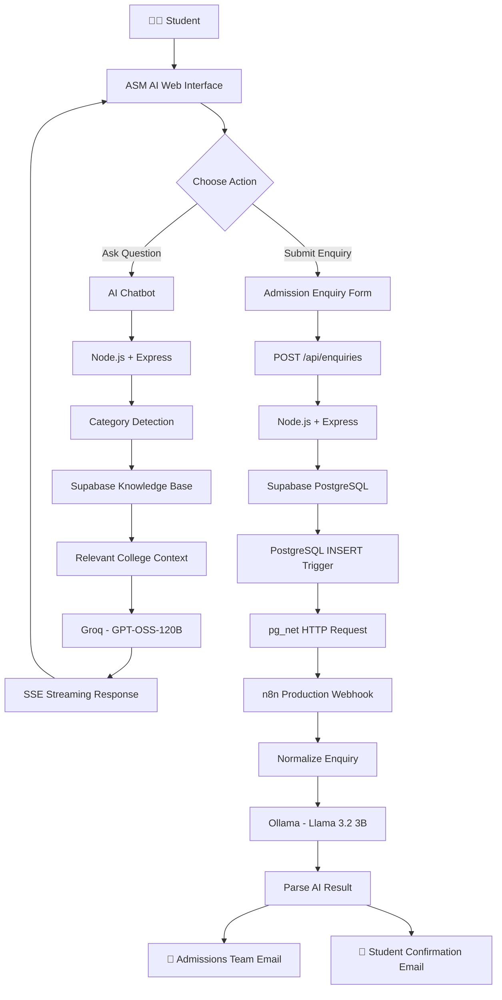
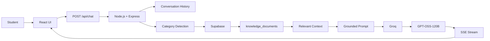
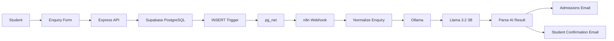
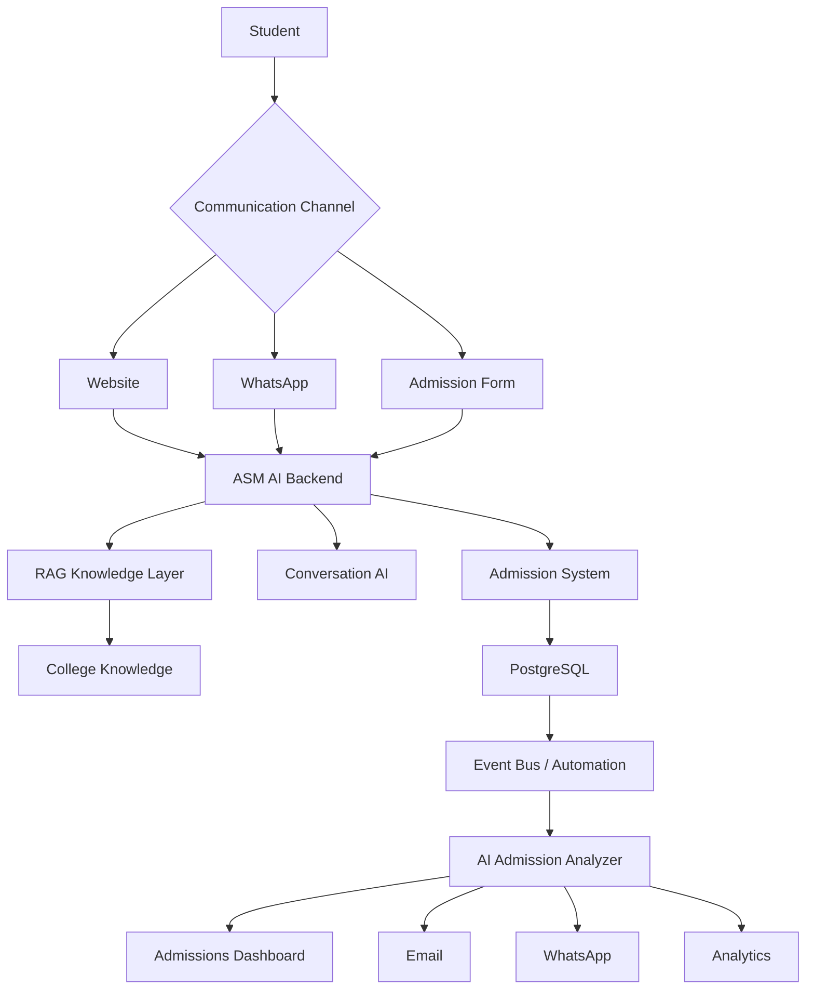

<div align="center">


# 🎓 ASM AI

### AI Student & Admission Assistant

<p>
  <strong>RAG-Powered College Chatbot • Intelligent Admission Automation • Event-Driven Architecture</strong>
</p>

<p>
  An AI-powered assistant designed for ASM College of Commerce, Science & Information Technology (CSIT), built to help students get reliable college information and automate admission enquiry handling.
</p>

<br/>


<br/><br/>


<br/><br/>

<a href="https://github.com/armaankhantech/asm-ai-student-admission-assistant">

</a>

<a href="https://www.csit.edu.in/">

</a>

</div>

---

# 🧠 What is ASM AI?

**ASM AI** is an AI-powered student and admission assistant created for **ASM College of Commerce, Science & Information Technology (CSIT)**.

The system combines two major capabilities:

### 💬 1. AI College Assistant

Students can ask questions about the college, courses, admissions, fees, placements, infrastructure, contact information and other supported college information.

The chatbot uses a **Retrieval-Augmented Generation (RAG)** approach so that responses are grounded in the college's verified knowledge base rather than relying only on general model knowledge.

### ⚡ 2. Admission Enquiry Automation

When a student submits the admission enquiry form:

```text
Student
   ↓
ASM AI Enquiry Form
   ↓
Node.js / Express API
   ↓
Supabase PostgreSQL
   ↓
PostgreSQL INSERT Trigger
   ↓
pg_net
   ↓
n8n Webhook
   ↓
AI Admission Analyzer
   ↓
Structured Enquiry Analysis
   ↓
┌───────────────────────────┐
│                           │
▼                           ▼
Admissions Team Email    Student Email
```

The entire process is automated without requiring the admission team to manually monitor a spreadsheet.

---

# ✨ Why ASM AI?

Traditional college enquiry systems often look like:

```text
Student submits form
        ↓
Data stored somewhere
        ↓
Staff manually checks it
        ↓
Staff understands enquiry
        ↓
Staff sends response
```

ASM AI changes the workflow into:

```text
Student submits enquiry
        ↓
Database records enquiry
        ↓
Database event fires
        ↓
n8n receives event
        ↓
AI analyzes enquiry
        ↓
Admissions team notified
        ↓
Student receives confirmation
```

This creates a much more structured and event-driven admission workflow.

---

# 🚀 Core Features

<table>
<tr>
<td width="50%">

### 💬 AI College Chatbot

- Student-friendly conversational interface
- College-specific knowledge
- Retrieval-first architecture
- Grounded responses
- Category-aware retrieval
- Streaming responses
- Conversation history handling
- Strict knowledge grounding

</td>

<td width="50%">

### 📝 Smart Enquiry System

- Student admission enquiry form
- Name validation
- Mobile validation
- Email validation
- Course selection
- Enquiry type
- Student question
- Backend validation
- Supabase persistence

</td>
</tr>

<tr>
<td>

### 🧠 AI Admission Analyzer

- Local AI processing
- Intent classification
- Course detection
- Topic extraction
- Priority classification
- Follow-up detection
- Enquiry summary
- Recommended action

</td>

<td>

### ⚡ Event-Driven Automation

- PostgreSQL trigger
- `pg_net`
- n8n webhook
- Automatic workflow execution
- No spreadsheet polling
- No manual trigger
- Database-first architecture

</td>
</tr>

<tr>
<td>

### 📧 Dual Email Automation

**Admissions Team**

- Complete student details
- Full enquiry
- AI analysis
- Priority
- Recommended action

</td>

<td>

### 📩 Student Confirmation

- Professional confirmation email
- Course information
- Admission enquiry acknowledgement
- Next-step information
- Admissions WhatsApp CTA
- ASM CSIT branding

</td>
</tr>
</table>

---

# 🏗️ Architecture

## 🌐 Complete ASM AI Architecture



---

# 💬 Chatbot Architecture

The chatbot and admission automation are intentionally separated.

**n8n does not run the main chatbot.**

The chatbot remains inside the Node.js backend because conversational retrieval, knowledge grounding and response streaming belong to the application layer.



### Chatbot principle

```text
Student Question
      ↓
Understand the category
      ↓
Retrieve relevant college knowledge
      ↓
Build grounded context
      ↓
Generate response
      ↓
Stream answer to student
```

The goal is to make the model answer using **verified ASM CSIT information**, rather than allowing unsupported information to be freely invented.

---

# ⚡ Admission Automation Architecture

The admission automation follows an event-driven pattern.



---

# 🔥 The Important Architectural Decision

The database is not just storage.

It also acts as the **event source**.

```text
                    ┌──────────────────┐
                    │ Student Enquiry  │
                    └────────┬─────────┘
                             │
                             ▼
                    ┌──────────────────┐
                    │ Node.js Backend  │
                    └────────┬─────────┘
                             │
                             ▼
                    ┌──────────────────┐
                    │ Supabase / PG    │
                    │ admission_enquiry│
                    └────────┬─────────┘
                             │
                       INSERT EVENT
                             │
                             ▼
                    ┌──────────────────┐
                    │ PostgreSQL       │
                    │ Trigger          │
                    └────────┬─────────┘
                             │
                             ▼
                    ┌──────────────────┐
                    │ pg_net           │
                    └────────┬─────────┘
                             │
                             ▼
                    ┌──────────────────┐
                    │ n8n Webhook      │
                    └──────────────────┘
```

This means the system does not need to continuously poll a Google Sheet to discover new enquiries.

---

# 🧩 Technology Stack

<div align="center">

| Layer | Technology |
|---|---|
| 🎨 Frontend | React + TypeScript |
| ⚙️ Backend | Node.js + Express.js |
| 🗄️ Database | Supabase PostgreSQL |
| 🧠 RAG Knowledge | Supabase `knowledge_documents` |
| 🤖 Chatbot LLM | GPT-OSS-120B via Groq |
| 🧠 Admission Analyzer | Llama 3.2 3B via Ollama |
| ⚡ Automation | n8n |
| 🔗 Database Events | PostgreSQL Trigger + `pg_net` |
| 📧 Email Automation | Gmail / n8n |
| 🔄 API Communication | HTTP / JSON |
| 📡 Chat Streaming | Server-Sent Events |
| 🔐 Configuration | Environment Variables |

</div>

---

# 🤖 Two AI Models — Two Different Jobs

One of the important design decisions in ASM AI is that the same model does not need to perform every task.

| AI System | Model | Responsibility |
|---|---|---|
| 💬 Student Chatbot | GPT-OSS-120B via Groq | Generate grounded conversational answers |
| 🧠 Admission Analyzer | Llama 3.2 3B via Ollama | Analyze and structure admission enquiries |

### Why?

The chatbot needs stronger conversational reasoning and contextual response generation.

The admission automation only needs structured classification and analysis.

Therefore:

```text
                    ASM AI
                      │
            ┌─────────┴─────────┐
            │                   │
            ▼                   ▼
       CHATBOT             AUTOMATION
            │                   │
            ▼                   ▼
   GPT-OSS-120B           Llama 3.2 3B
       via Groq             via Ollama
            │                   │
            ▼                   ▼
  Student Conversation    Enquiry Analysis
```

This keeps the architecture modular.

---

# 🧠 RAG Knowledge System

The chatbot uses a retrieval-first approach.

Instead of simply asking the LLM:

```text
"Answer this student question."
```

the system follows:

```text
Student Question
       ↓
Detect relevant category
       ↓
Retrieve matching ASM CSIT knowledge
       ↓
Build context
       ↓
Give context to LLM
       ↓
Generate grounded answer
```

The knowledge source is stored in Supabase.

The chatbot retrieves published knowledge from:

```text
knowledge_documents
```

and uses category-based retrieval for supported topics.

---

# 📚 Supported Knowledge Categories

The current chatbot architecture supports categories including:

- Admissions
- Fees
- Contact / Location
- Placements
- Infrastructure
- Global Partners
- Courses
- College Information
- FAQs

The exact available answers depend on the verified content stored in the ASM CSIT knowledge base.

---

# 📝 Admission Enquiry Flow

A student submits:

```json
{
  "fullName": "Demo Student",
  "mobile": "9876543210",
  "email": "student@example.com",
  "interestedCourse": "BCA",
  "enquiryType": "Admission process",
  "question": "I want to know about the admission process."
}
```

The backend validates the request before inserting it into the database.

---

# 🔐 Backend Validation

The enquiry API validates:

- Student name
- Mobile number
- Email address
- Course
- Enquiry type
- Student question

Invalid requests are rejected before database insertion.

Example:

```text
Frontend
   ↓
POST /api/enquiries
   ↓
Validation
   ↓
Valid?
 ┌───────┴───────┐
 │               │
NO              YES
 │               │
 ▼               ▼
4xx Error      Supabase
                 ↓
              Success
```

---

# 🗄️ Database

The primary admission table is:

```text
admission_enquiries
```

Important fields include:

```text
id
student_name
contact
email
course
enquiry
enquiry_type
intent
priority
status
original_message
created_at
updated_at
```

The database stores the original enquiry.

The AI analysis is currently processed inside the n8n automation and used to enrich notification emails rather than being written back into the database.

---

# ⚡ n8n Workflow

The current workflow is:

```text
Webhook
   ↓
Normalize Enquiry
   ↓
AI Admission Analyzer
   ↓
Parse AI Result
   ↓
┌─────────────────────────────┐
│                             │
▼                             ▼
Notify Admissions Team   Send Student Confirmation
```

---

# 🧠 AI Admission Analysis

The local AI analyzer converts the raw enquiry into structured information.

Example:

```json
{
  "intent": "admission",
  "course": "BCA",
  "topics": [
    "admission process",
    "application process"
  ],
  "priority": "normal",
  "requires_followup": true,
  "summary": "The student is interested in BCA admission and wants information about the application process and next steps.",
  "recommended_action": "Follow up with the student and provide the BCA admission application process and relevant next steps."
}
```

This allows the admission team to understand the enquiry quickly without manually reading and categorizing every submission.

---

# 📧 Admissions Team Notification

The admissions team receives a structured email containing:

### Student Details

- Student name
- Mobile number
- Email
- Course

### Enquiry Details

- Enquiry type
- Complete student question
- Enquiry ID
- Submission timestamp

### AI Analysis

- Intent
- Course
- Topics
- Priority
- Follow-up requirement
- AI summary
- Recommended action

Example workflow:

```text
New Enquiry
     ↓
AI Analysis
     ↓
Admissions Team
     ↓
Understand enquiry instantly
     ↓
Follow up with student
```

---

# 📩 Student Confirmation Email

After the enquiry is processed, the student receives a professional confirmation email.

The email includes:

- ASM CSIT branding
- Confirmation that the enquiry was received
- Student name
- Interested course
- What happens next
- Admissions team contact CTA
- WhatsApp contact option

The student's full question is intentionally not repeated in the confirmation email because the student already knows what they submitted.

---

# 📱 WhatsApp Strategy — V1

Direct WhatsApp API automation is **not part of ASM AI V1**.

Instead, the confirmation email contains a clickable WhatsApp CTA that allows the student to contact the admissions team.

```text
Student Confirmation Email
          ↓
"Chat with our Admission Team on WhatsApp"
          ↓
Official ASM CSIT WhatsApp Contact
```

This was intentionally chosen for the V1 demo because an official college-owned WhatsApp Business/API setup was not available during development.

### Planned V2

Once the college provides the official WhatsApp Business/API setup:

```text
Student
   ↓
WhatsApp
   ↓
WhatsApp Business API
   ↓
ASM AI Backend
   ↓
RAG Knowledge Base
   ↓
AI Response
   ↓
Student
```

---

# 🧱 Project Structure

The repository is organized around the frontend, backend and application services.

```text
ASM AI/
│
├── ASM frontend/
│   │
│   └── client/
│       │
│       ├── src/
│       │   │
│       │   ├── components/
│       │   │   │
│       │   │   └── enquiry/
│       │   │       ├── EnquiryForm.tsx
│       │   │       ├── EnquiryStatus.tsx
│       │   │       └── EnquiryAside.tsx
│       │   │
│       │   ├── services/
│       │   │   └── enquiryService.ts
│       │   │
│       │   └── types/
│       │       └── enquiry.ts
│       │
│       └── package.json
│
├── backend/
│   │
│   ├── routes/
│   │   ├── chat.js
│   │   └── enquiries.js
│   │
│   ├── db.js
│   ├── server.js
│   ├── test-groq.js
│   ├── package.json
│   └── .env
│
├── README.md
│
└── .gitignore
```

> The n8n workflow and credentials are configured separately from the application repository so secrets and external service credentials are not committed to Git.

---

# 🔌 Backend API

## Health Check

```http
GET /api/health
```

Used to confirm that the backend is running.

---

## Database Test

```http
GET /api/test-db
```

Used to verify backend → Supabase connectivity.

---

## Chat

```http
POST /api/chat
```

Handles student chatbot conversations.

The endpoint performs:

```text
Request
  ↓
Conversation normalization
  ↓
Category detection
  ↓
Knowledge retrieval
  ↓
Grounded context
  ↓
LLM generation
  ↓
SSE response
```

---

## Admission Enquiry

```http
POST /api/enquiries
```

Accepts student enquiry data and stores it in Supabase.

Example:

```json
{
  "fullName": "Demo Student",
  "mobile": "9876543210",
  "email": "student@example.com",
  "interestedCourse": "BCA",
  "enquiryType": "Admission process",
  "question": "I want to know about the admission process."
}
```

Successful submission results in:

```text
API
 ↓
Supabase
 ↓
PostgreSQL Trigger
 ↓
n8n
```

---

# 🔗 Event Payload

The PostgreSQL trigger sends a webhook payload similar to:

```json
{
  "event": "INSERT",
  "table": "admission_enquiries",
  "record": {
    "id": "generated-uuid",
    "student_name": "Demo Student",
    "contact": "9876543210",
    "email": "student@example.com",
    "course": "BCA",
    "enquiry": "I want to know about the admission process.",
    "enquiry_type": "Admission process",
    "priority": "normal",
    "status": "new"
  }
}
```

The n8n normalization step converts this into a clean internal structure.

---

# 🧩 PostgreSQL → n8n Trigger

The database trigger follows this architecture:

```sql
CREATE OR REPLACE FUNCTION public.notify_n8n_new_enquiry()
RETURNS trigger
LANGUAGE plpgsql
SECURITY DEFINER
SET search_path = public, extensions, net
AS $$
BEGIN

    PERFORM net.http_post(
        url := '<YOUR_N8N_PRODUCTION_WEBHOOK_URL>',
        headers := jsonb_build_object(
            'Content-Type', 'application/json'
        ),
        body := jsonb_build_object(
            'event', 'INSERT',
            'table', 'admission_enquiries',
            'record', to_jsonb(NEW)
        )
    );

    RETURN NEW;

END;
$$;
```

Then:

```sql
CREATE TRIGGER admission_enquiry_n8n_trigger
AFTER INSERT ON public.admission_enquiries
FOR EACH ROW
EXECUTE FUNCTION public.notify_n8n_new_enquiry();
```

> Replace `<YOUR_N8N_PRODUCTION_WEBHOOK_URL>` with your own private n8n endpoint. Never commit private webhook URLs or credentials to a public repository.

---

# 🎯 Why PostgreSQL Trigger Instead of Google Sheets?

The earlier admission automation used a spreadsheet-driven workflow.

ASM AI V1 moved the event source closer to the actual application database.

### Previous approach

```text
Form
 ↓
Google Sheet
 ↓
Trigger
 ↓
n8n
```

### ASM AI V1

```text
Form
 ↓
Backend
 ↓
PostgreSQL
 ↓
Database Event
 ↓
n8n
```

### Advantages

- Database becomes the source of truth
- No spreadsheet polling
- No duplicate database insert from n8n
- Cleaner event-driven design
- Faster automation
- Better separation between application and automation

---

# 🚫 Avoiding an Automation Loop

An important architectural problem was intentionally avoided.

The old pattern could have become:

```text
PostgreSQL
   ↓
n8n
   ↓
Save to PostgreSQL
   ↓
PostgreSQL Trigger
   ↓
n8n
   ↓
...
```

This creates a potential infinite automation loop.

ASM AI V1 instead uses:

```text
Student
 ↓
Backend
 ↓
PostgreSQL
 ↓
Trigger
 ↓
n8n
 ↓
AI
 ↓
Notifications
```

n8n does **not** insert the same enquiry back into the database.

---

# 🛠️ Local Setup

## 1. Clone the Repository

```bash
git clone https://github.com/armaankhantech/asm-ai-student-admission-assistant.git
```

Enter the project:

```bash
cd asm-ai-student-admission-assistant
```

Check the repository:

```bash
git status
```

---

# ⚙️ 2. Backend Setup

Move into the backend:

```bash
cd backend
```

Install dependencies:

```bash
npm install
```

Create:

```text
.env
```

Add:

```env
PORT=3000

SUPABASE_URL=YOUR_SUPABASE_PROJECT_URL
SUPABASE_SECRET_KEY=YOUR_SUPABASE_SECRET_KEY

GROQ_API_KEY=YOUR_GROQ_API_KEY
GROQ_MODEL=openai/gpt-oss-120b
```

### Important

Never commit `.env`.

Do not expose:

```text
SUPABASE_SECRET_KEY
GROQ_API_KEY
```

to the frontend or public repository.

---

# ▶️ 3. Start the Backend

Inside:

```text
backend/
```

run:

```bash
npm start
```

or use the development command defined by your `package.json`.

The backend should run on:

```text
http://localhost:3000
```

Test:

```text
GET /api/health
```

and:

```text
GET /api/test-db
```

---

# 🎨 4. Frontend Setup

Open a second terminal.

Move into:

```bash
cd "ASM frontend/client"
```

Install dependencies:

```bash
npm install
```

Start the frontend:

```bash
npm run dev
```

Open the local URL displayed by the frontend development server.

---

# 🗄️ 5. Supabase Setup

Create a Supabase project.

The application requires PostgreSQL storage for the ASM AI data layer.

The admission automation uses:

```text
admission_enquiries
```

The chatbot uses the existing knowledge system including:

```text
knowledge_documents
```

The backend connects to Supabase using:

```env
SUPABASE_URL=
SUPABASE_SECRET_KEY=
```

---

# 🧠 6. Chatbot Model Setup

The chatbot currently uses:

```text
GPT-OSS-120B
```

through Groq.

Configure:

```env
GROQ_API_KEY=YOUR_GROQ_API_KEY
GROQ_MODEL=openai/gpt-oss-120b
```

The exact model availability depends on the provider's current model catalog.

---

# 🤖 7. Ollama Setup

The admission analyzer uses a local Ollama model.

Install Ollama and pull:

```bash
ollama pull llama3.2:3b
```

Verify:

```bash
ollama list
```

The n8n workflow communicates with:

```text
http://host.docker.internal:11434
```

when n8n is running inside Docker and Ollama is running on the host machine.

---

# ⚡ 8. n8n Setup

The admission automation requires a self-hosted n8n instance.

The workflow is:

```text
Webhook
   ↓
Normalize Enquiry
   ↓
AI Admission Analyzer
   ↓
Parse AI Result
   ↓
┌──────────────────────┐
│                      │
▼                      ▼
Admissions Email    Student Email
```

Configure:

- Webhook
- Ollama HTTP request
- Gmail credentials
- Production webhook
- PostgreSQL trigger

Do not commit credentials into the repository.

---

# 📧 Gmail Setup

The n8n workflow uses Gmail for two notification paths.

### Branch 1

```text
AI Analysis
   ↓
Admissions Team
```

### Branch 2

```text
AI Analysis
   ↓
Student Confirmation
```

You must configure your own Gmail OAuth credentials inside n8n.

---

# 🌐 Development Tunnel Note

During the V1 demo, the local n8n instance can be exposed through a secure tunnel such as ngrok so Supabase can reach the webhook.

The repository intentionally does **not** contain the current tunnel URL.

For permanent deployment, use a stable HTTPS endpoint instead of depending on a temporary development tunnel.

---

# 🧪 Testing the Complete System

The complete V1 flow can be tested with one enquiry.

## Step 1

Open the ASM AI website.

## Step 2

Open the admission enquiry form.

## Step 3

Enter:

```text
Name
Mobile
Email
Course
Enquiry Type
Question
```

## Step 4

Submit the form.

## Step 5

Backend receives:

```text
POST /api/enquiries
```

## Step 6

Supabase stores the enquiry.

## Step 7

PostgreSQL trigger fires.

## Step 8

`pg_net` sends the event to n8n.

## Step 9

n8n normalizes the data.

## Step 10

Ollama analyzes the enquiry.

## Step 11

AI result is parsed.

## Step 12

Admissions team receives an email.

## Step 13

Student receives confirmation email.

### Complete test:

```text
Frontend
   ↓
Backend
   ↓
Supabase
   ↓
PostgreSQL Trigger
   ↓
pg_net
   ↓
n8n
   ↓
Ollama
   ↓
AI Analysis
   ↓
┌───────────────────────┐
│                       │
▼                       ▼
Admissions Email    Student Email
```

---

# ✅ V1 Completion Checklist

| Component | Status |
|---|---|
| ASM AI Frontend | ✅ |
| Admission Enquiry UI | ✅ |
| Email Validation | ✅ |
| Backend API | ✅ |
| Supabase Database | ✅ |
| PostgreSQL Trigger | ✅ |
| `pg_net` Integration | ✅ |
| n8n Webhook | ✅ |
| Enquiry Normalization | ✅ |
| Local AI Analyzer | ✅ |
| AI Result Parsing | ✅ |
| Admissions Email | ✅ |
| Student Confirmation Email | ✅ |
| WhatsApp CTA | ✅ |
| Direct WhatsApp API | ⏳ V2 |
| Stable Production Hosting | ⏳ V2 |
| Admin Dashboard | ⏳ V2 |

---

# 🔐 Security Considerations

ASM AI V1 follows basic security practices.

### Environment Variables

Secrets are stored outside source code:

```env
SUPABASE_SECRET_KEY=
GROQ_API_KEY=
```

### Backend-Only Secrets

Supabase secret credentials are used by the backend and should never be exposed to the frontend.

### Input Validation

Admission enquiry fields are validated before insertion.

### No Credentials in Git

The repository should never contain:

```text
.env
API keys
OAuth credentials
Private webhook secrets
Database passwords
```

### Future Hardening

For a production deployment, add:

- Webhook authentication/signing
- Rate limiting
- Authentication where required
- Request size limits
- Retry policies
- Failure alerts
- Centralized logging
- Stable HTTPS infrastructure

---

# 🛡️ Failure Handling

Current V1 includes basic application-level validation and error handling.

Typical failure points include:

```text
Frontend
   ↓
Backend
   ↓
Database
   ↓
Webhook
   ↓
AI
   ↓
Email
```

A failure at any layer can stop the downstream process.

For a production deployment, the recommended architecture is:

```text
                    ┌──────────────┐
                    │ Main Workflow│
                    └──────┬───────┘
                           │
                    ┌──────▼───────┐
                    │ Retry Logic  │
                    └──────┬───────┘
                           │
                 ┌─────────▼─────────┐
                 │ Failure Notification│
                 └────────────────────┘
```

---

# 🎨 UI Philosophy

ASM AI is designed to remain secondary to the official ASM CSIT website rather than replacing the institution's identity.

The interface focuses on:

- Clean student experience
- College branding
- Accessible enquiry flow
- Clear chatbot entry point
- Responsive layout
- Professional confirmation states
- Mobile-friendly interaction
- Minimal friction

The chatbot is intended to feel like a helpful college assistant rather than a generic AI product.

---

# 📸 Demo Gallery

> Add your final screenshots here after uploading them to the GitHub repository.

Recommended screenshots:

```text
01 — ASM AI Homepage
02 — AI Chatbot
03 — RAG Response
04 — Admission Enquiry Form
05 — Supabase Admission Record
06 — n8n Automation Workflow
07 — AI Admission Analysis
08 — Admissions Team Email
09 — Student Confirmation Email
```

Example:

```html
<p align="center">
  
</p>
```

You can replace each placeholder with GitHub-hosted screenshots once the final UI capture is ready.

---

# 🎥 Demo Video

A short demo can showcase the complete V1 workflow:

```text
00:00 — ASM AI Homepage
00:15 — Ask the AI a college question
00:35 — AI grounded response
00:50 — Open Admission Enquiry
01:10 — Submit enquiry
01:25 — Supabase record created
01:35 — n8n workflow triggered
01:50 — AI enquiry analysis
02:05 — Admissions email
02:20 — Student confirmation email
02:35 — Final architecture
```

Recommended video flow:

```text
Student Interaction
        ↓
AI Response
        ↓
Admission Enquiry
        ↓
Automation
        ↓
AI Analysis
        ↓
Two Emails
```

---

# 🧠 What Makes ASM AI Unique?

ASM AI is not simply:

```text
Chatbot + Form
```

It combines:

```text
RAG
+
Conversational AI
+
Database Architecture
+
Event-Driven Systems
+
Local AI
+
Workflow Automation
+
Email Automation
```

The interesting part is how these components communicate.

```text
                 ASM AI
                    │
       ┌────────────┴────────────┐
       │                         │
       ▼                         ▼
   AI CHATBOT              ADMISSION SYSTEM
       │                         │
       ▼                         ▼
    RAG + LLM              PostgreSQL Event
       │                         │
       ▼                         ▼
   Student Answer             n8n
                                 │
                                 ▼
                           Local AI Analysis
                                 │
                         ┌───────┴───────┐
                         ▼               ▼
                    Admissions       Student
                       Email         Confirmation
```

---

# 💡 Key Engineering Lessons

Building ASM AI involved several practical engineering decisions.

### 1. Separate application logic from automation

The chatbot stays in the Node.js application.

n8n handles admission workflow automation.

---

### 2. Use the database as the source of truth

The enquiry is stored before automation begins.

```text
Database First
     ↓
Automation Second
```

---

### 3. Trigger automation from events

Instead of repeatedly asking:

```text
"Are there any new enquiries?"
```

the system reacts when:

```text
INSERT
```

occurs.

---

### 4. Use different AI models for different jobs

A conversational LLM does not have to be responsible for every task.

---

### 5. Keep AI grounded

The chatbot should use the verified ASM CSIT knowledge base instead of freely inventing college information.

---

### 6. Avoid automation loops

n8n does not reinsert the same admission enquiry into the database.

---

### 7. Keep secrets outside the repository

API keys and private infrastructure details belong in environment variables and secure service credentials.

---

# 🧪 Example End-to-End Scenario

Imagine a student wants to know about BCA admission.

The student asks:

```text
I want to know about BCA admission and how I can apply.
```

The chatbot:

```text
Student
 ↓
ASM AI
 ↓
Category Detection
 ↓
Knowledge Retrieval
 ↓
Verified ASM CSIT Context
 ↓
GPT-OSS-120B
 ↓
Grounded Response
```

If the student then submits an enquiry:

```text
Student
 ↓
Admission Form
 ↓
Express
 ↓
Supabase
 ↓
PostgreSQL Trigger
 ↓
n8n
 ↓
Llama 3.2 3B
 ↓
Admission Analysis
 ↓
┌────────────────────┐
│                    │
▼                    ▼
Admissions Team    Student
Email              Email
```

This creates a continuous student journey from **information discovery → enquiry → automated follow-up**.

---

# 📊 System Design Principles

ASM AI follows these principles:

```text
                    ┌────────────────────┐
                    │   ASM AI DESIGN    │
                    └─────────┬──────────┘
                              │
        ┌─────────────────────┼─────────────────────┐
        │                     │                     │
        ▼                     ▼                     ▼
     Grounded              Modular             Event-Driven
        │                     │                     │
        ▼                     ▼                     ▼
  Verified Data        Separate Services      Database Events
        │                     │                     │
        └─────────────────────┼─────────────────────┘
                              │
                              ▼
                       Student Experience
```

---

# 💰 Cost Philosophy

ASM AI V1 was designed around a **₹0 development-cost target** by using free, local and self-hosted components wherever realistically possible.

Examples include:

- Self-hosted n8n
- Local Ollama model
- Supabase free-tier infrastructure
- Groq free-tier access where available
- Existing development tools
- Local development environment

> Third-party free tiers and provider limits can change. Production deployments may require paid infrastructure.

---

# 🚧 Current V1 Limitations

ASM AI V1 is a **proof-of-work/demo**, not a final production deployment.

Current limitations include:

### WhatsApp API

Direct WhatsApp Business API integration is deferred until an official college-owned WhatsApp setup is available.

### Tunnel Dependency

The demo automation can use a development tunnel for the n8n webhook.

A permanent deployment should use stable HTTPS infrastructure.

### AI Analysis Persistence

The AI admission analysis is currently used within n8n notification flow and is not persisted back into the admission database.

### Authentication

The current V1 does not implement a complete staff/admin authentication system.

### Rate Limiting

Production-grade rate limiting should be added before public deployment.

### Observability

A production version should include centralized logs, monitoring and workflow failure alerts.

---

# 🛣️ Roadmap

## 🟢 V1 — Completed

- [x] ASM CSIT frontend
- [x] AI college chatbot
- [x] RAG knowledge retrieval
- [x] Student admission enquiry form
- [x] Email validation
- [x] Node.js backend
- [x] Supabase database
- [x] PostgreSQL trigger
- [x] `pg_net`
- [x] n8n webhook
- [x] Local Ollama AI analyzer
- [x] Structured AI analysis
- [x] Admissions notification
- [x] Student confirmation email
- [x] WhatsApp CTA
- [x] End-to-end testing

---

## 🔵 V2 — Planned

- [ ] Official WhatsApp Business API
- [ ] Continuous WhatsApp AI chatbot
- [ ] Stable hosted n8n
- [ ] Webhook authentication
- [ ] Retry / failure queues
- [ ] AI result persistence
- [ ] Admission dashboard
- [ ] Enquiry analytics
- [ ] Staff authentication
- [ ] Rate limiting
- [ ] Better monitoring
- [ ] Automated testing
- [ ] Production deployment

---

# 🔮 Future Architecture

The long-term system could evolve into:



---

# 🧭 Deployment Philosophy

For a real deployment, the architecture should evolve from:

```text
Local Machine
+
ngrok
+
Self-hosted Services
```

towards:

```text
                  Internet
                     │
                     ▼
              Stable HTTPS
                     │
          ┌──────────┴──────────┐
          │                     │
          ▼                     ▼
       Frontend              Backend
                                │
                    ┌───────────┴───────────┐
                    │                       │
                    ▼                       ▼
                Supabase                 AI Layer
                                            │
                                  ┌─────────┴─────────┐
                                  ▼                   ▼
                                Groq               Ollama
                                                      │
                                                      ▼
                                                     n8n
                                                      │
                                      ┌───────────────┴───────────────┐
                                      ▼                               ▼
                                  Admissions                       Student
                                    Email                           Email
```

---

# 🏆 Project Outcome

ASM AI V1 demonstrates how a college can combine:

```text
AI
+
RAG
+
Modern Web Development
+
PostgreSQL
+
Event-Driven Architecture
+
Workflow Automation
+
Local AI
+
Email Automation
```

into a practical student-facing system.

The project is designed not only as a chatbot, but as a **complete admission interaction workflow**.

---

# 👨‍💻 Built By

<div align="center">

## Armaan Khan

AI Automation • Full-Stack Development • RAG Systems • Workflow Automation

<br/>

<a href="https://github.com/armaankhantech">

</a>

<a href="https://www.linkedin.com/in/armaankhan-tech/">

</a>

<a href="https://twitter.com/armaankhantech">

</a>

</div>

---

# 🏫 ASM CSIT

ASM AI is designed for:

**ASM College of Commerce, Science & Information Technology (CSIT)**

Official website:

https://www.csit.edu.in/

Admission information:

https://www.csit.edu.in/admission

---

# 📜 License

This repository is currently presented as a **college-focused proof-of-work / V1 demo project**.

Before redistributing, commercializing, or deploying the system for another institution, review the repository contents, third-party licenses, ASM CSIT branding/assets and applicable service terms.

---

# ⭐ Final Note

ASM AI started with a simple idea:

> **Make college information easier to access and make admission enquiries easier to manage.**

It evolved into a system where:

```text
Student asks
      ↓
AI understands
      ↓
Knowledge is retrieved
      ↓
Student gets an answer
```

and:

```text
Student enquires
      ↓
Database records
      ↓
Event triggers
      ↓
AI analyzes
      ↓
Admissions team is notified
      ↓
Student receives confirmation
```

That is the core of **ASM AI V1**.

---

<div align="center">

### 🎓 ASM AI — AI Student & Admission Assistant

**Built for ASM CSIT • Powered by AI • Designed for Students**

<br/>


<br/><br/>

<strong>⭐ If you found this project interesting, consider giving the repository a star.</strong>

</div>
